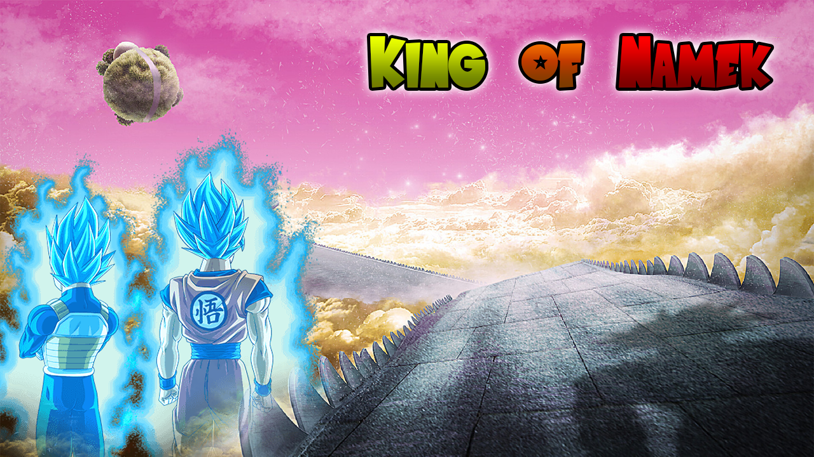
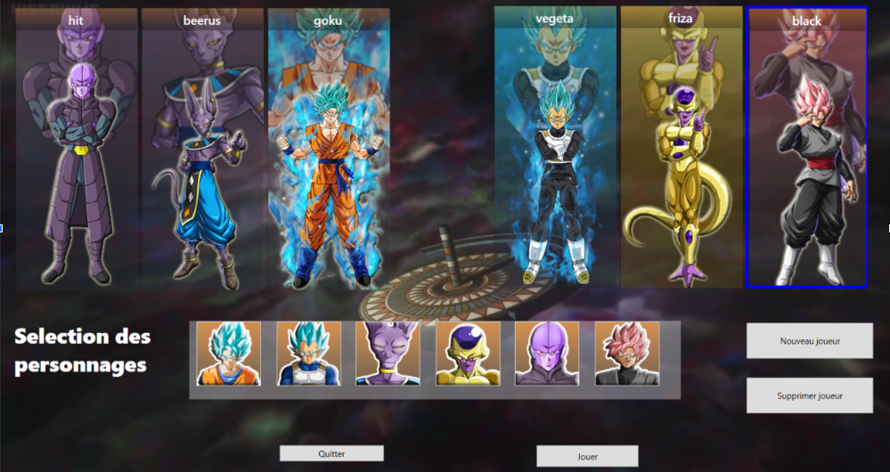
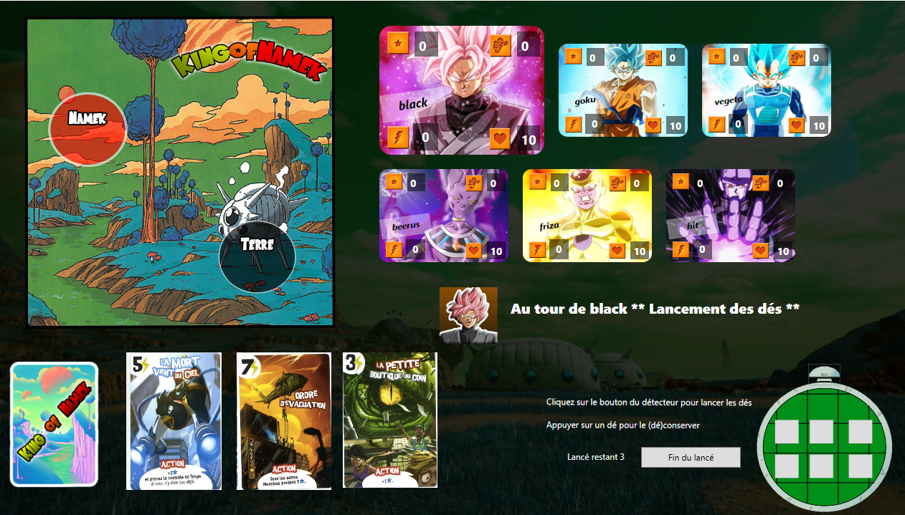

## King Of Namek 🎲 🖧 
  

    

  

## Language

 

### [EN] King of Namek ?

**King Of Namek** is a board game based on "King Of Tokyo". In this game, you play as characters from the Dragon Ball universe to fight in a fun and chaotic atmosphere, on the planet Namek.
Rolling the dice allows you to perform different actions related to your strategy.
Will you attack? Heal yourself? Buy cards?

- .NET
- Threads, asynchronous programming
- Socket
- Local version of the game (player vs AI)
- Online version of the game (6 players maximum)

This game has been developped for a school project to learn about OOP and TCP/UDP network.

### [FR] King of Namek ?

**King Of Namek** est un jeu de plateau basé sur "King Of Tokyo". Dans ce jeu, vous incarnez des personnages de l'univers de Dragon Ball pour combattre dans une atmosphère fun et chaotique, sur la planète Namek.
Lancer les dés permet d'effectuer différentes actions en lien avec votre stratégie.
Allez-vous attaquer ? Vous soignez ? Acheter des cartes ?

- .NET
- Threads, programmation asynchrone
- Socket
- Version locale du jeu (joueur vs IA)
- Version en ligne du jeu (6 joueurs maximum)

Ce jeu a été développé dans le cadre d'un projet scolaire afin de s'initier à la POO et au réseau TCP/UDP.

### Screenshots

#### Character selection

#### In game 

